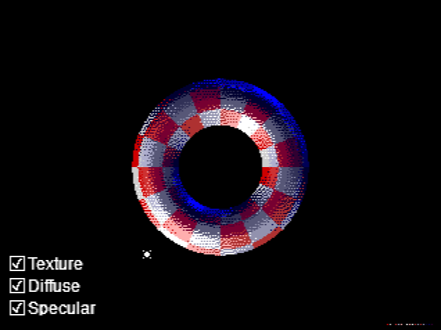
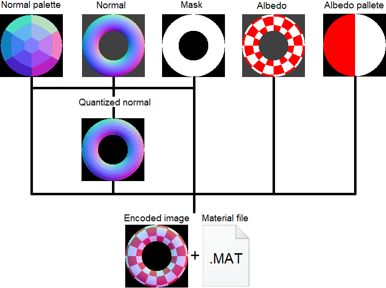
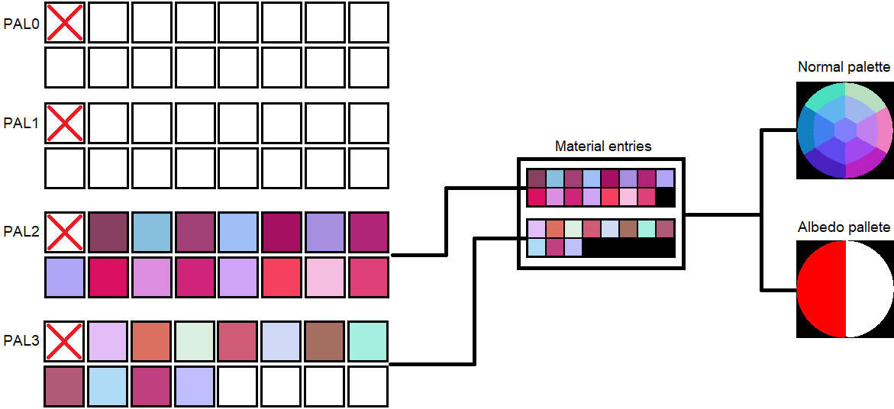
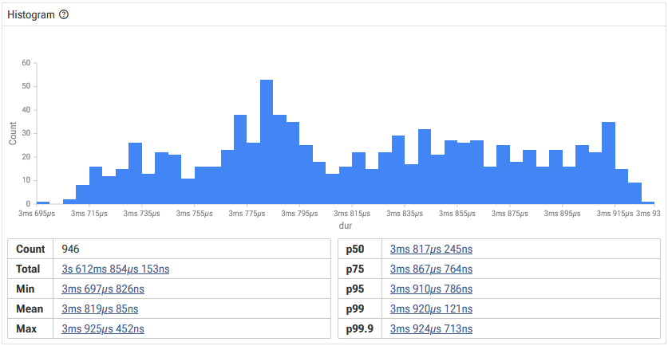
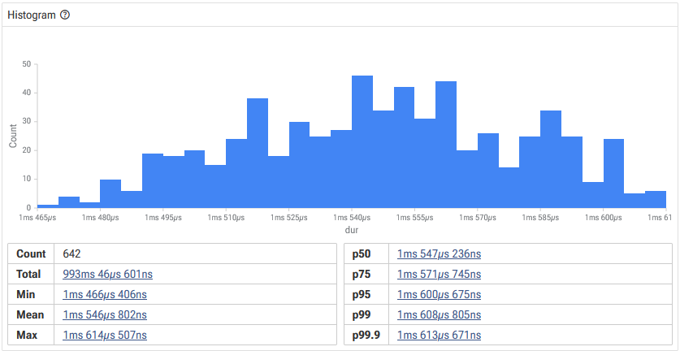

# Normal map demo

Demo showcasing the usage of normal maps on a Sega Megadrive. It shows a checkered torus with a double-sided directional light spinning randomly around it.
It's possible to manually control the direction and toggle the texture and light diffuse and specular components. Random spinning will resume automaticaly
after 3 seconds of inactivity.

## Controls
* You can press any button during the title screen to shorten its duration.
* Use the D-PAD in port 1 controller or a Sega Mouse in port 2 to change the light direction
* Use the A button in port 1 controller or the left button in port 2 Sega Mouse to toggle the checkered texture
* Use the B button in port 1 controller or the right button in port 2 Sega Mouse to cycle the state of diffuse and specular components

## Tech breakdown:
The idea is exploiting the fact Sega Megarive graphics are pallete-based. Computing the light of every pixel and uploading the result to the VRAM would be extremely expensive (although I must admit I never got to implement that approach so I do not have actual measurements). Instead, we can choose a set of normal directions we want to support (a normals pallete) and assign each of them to a specific entry in the Color RAM. Then we can compute the lighting for each of these entries and all pixels using them will be automatically updated.
This technique supports one double sided colored directional light (the color can be different for each side). The lighting function includes diffuse and specular components.

If you prefer to read the code, check directly the file [src/engine/material/material.c](src/engine/material/material.c)

### Image conversion
The first step is converting the source images (albedo, mask and normal map) to a indexed image + a material file containing the actual properties for each material entry.

The normal map must be quantized with the chosen normals pallete. The albedo image may also need to be quantized to a more limited pallete.

#### Encoded image
The 64 colors Megadrive pallete is divided in four 16 color sub-palletes. Well, actually 15 colors, because the first entry is intepreted as transparent. Each 8x8 tile can only use one of these sub-palletes. If we want to use more than 15 colors in any of these regions, we need to layer multiple images (be it using sprites or tile-map planes). For example, the torus in this demo requires 26 pallete entries (2 albedo colors * 13 normals). So, since that goes beyond the 15 colors boundary, we need to split the image in 2 layers:

The color palette in the resulting image(s) is not relevant for the lightning algorithm, but for debugging purposes they should convey the encoded properties.

#### Material file
The material file contains:
* **Albedo colors:** Mostly for debugging purposes. Stored as non-packed RGB333.
* **Normals groups:** Ranges of sub-pallete entries needed to represent the material entries on each layer.
* **Normals pallete:** Needed to compute the dot products with the light direction. Stored as 3-byte vectors, where each byte represent a value in the [-1, 1) range.
* **Shades:** Precomputed shades for each albedo color and each possible light intensity combination (**NOTE:** the Megadrive has 3-bits per color component, so unless you want to get creative 8 shades per color should be enough). The number of shades must be a power of 2 (to use bit shifting instead of multiplications/division). To save on expensive multiplications, the light color will be baked in.
Shades data is stored in 2 different components:
    * **Diffuse:** Each shade is the lerp between pure black and the light color for its corresponding level.
    * **Specular:** This component is optional. Follows the Blinn-Phong reflection model. Each shade is also the lerp between pure black and the light color for it's corresponding level. But the level doesn't grow lienarly. Instead it's computed as: specular intensity * pow(level, specular hardness). **NOTE:** Specular is additive, so it must not be modulated by albedo colors. The final color must be computed in run time.

**NOTE:** When specular component is not used, diffuse shades can be stored directly as 16-bit VDP colors (the exact data that will be uploaded to CRAM). This saves a few bit manipulations in run time to generate them. But in order to use the specular component we need to perform color math, so it's better to store them as non-packed RGB333 to keep direct access to individual components.

### Loading the material file
Material files can be directly attached to the ROM using SGDK's rescomp.
Normals groups need to be processed in loading time to compute the absolute pallete indices after mapping each of them to the sub-palletes specified by the user.

In order to save some RAM, we can leave all the shades data in the ROM. We still need to create the pointers to them in run time, though.

**NOTE:** VDP colors are 16-bit integers. In order to access them, they must be aligned to 16-bits. Depending on the contents on the material file, we may need to add one byte of padding before the start of the diffuse component data.

### Runtime light computation
The lighting is computed for each component of each material entry.
#### Diffuse
The light strenght is computed as the dot product between the light direction and the entry normal. Then the strength is mapped into the pre-computed shades range and the closest shade index is calculated. If the light strength is negative, the back light shades will be used. Else, the front ones.
#### Specular
The specular component works similarly to the diffuse one, but instead of the light direction, the **half vector** is used. Where **half vector** = normalized(light direction + view direction). The view direction is considered fixed: from the screen center straight into the screen. Or in hard numbres, (0, 0, -1).
The specular shade is then added to the diffuse shade to obtain the final color.

### Limitations
The main limitation is the number of colors available in the CRAM. We need one color entry for each valid combination of properties (in this case albedo and normal). Moreover, since the colors are split in 4 sub-palletes, mixing and matching them is even more complex. As already mentioned, this problem can be mitigated by layering multiple images, each with a different sub-palette. The problem with this approach is every layer wastes VRAM and sprites/scroll planes.

On the flip side, the fewer the entries we need to compute the lighting for, the smaller the processing cost.

### Cost
Lighting the torus with both diffuse and specular takes around 24% of the frame:

On the other hand, diffuse only takes around 10%:

It's centainly not free, but it still leaves a substantial amount of time of time to perform other tasks. Besides, the current code is not specially optimized, so there is still margin for improvement.

## Tech Stack:
* [SGDK 2.11](https://github.com/Stephane-D/SGDK/releases/tag/v2.11) for handling all Sega Megadrive low-level management
* Visual Studio Code 
* Genesis Code extension for Visual Studio Code
* [Gens KMod](http://gendev.spritesmind.net/page-gensK.html) and [Blastem-mdp](https://github.com/Tails8521/blastem/releases/tag/1.0.0) for testing and debugging
* [md-profiler](https://github.com/Tails8521/md-profiler) for profiling
* Aseprite for pixel art edition and image conversion debugging
* Gimp for additional image editing
* Blender for sample torus modeling + normal and albdedo textures rendering
* A custom conversion tool that's not yet ready for public usage

## Special thanks
I'd like to thank the following people for making this project possible
* Stephane Dallongeville for the creation of SGDK
* Kaze Emanuar for suggesting encoding normal map in palletized image in [this video](https://www.youtube.com/watch?v=xIUkoUEMf_g&t=462s)

## Additional credits
This demo uses the following 3rd party resources:
* [**Arial font**](https://learn.microsoft.com/en-us/typography/font-list/arial)
* [**Ink Free font**](https://learn.microsoft.com/da-dk/typography/font-list/ink-free)
* **203344__klemmy__123-taiko-open.wav**: Taiko beat sound.
    * Obtained from freesounds.org, unmodified
    * Attibution text: [123-Taiko-Open.wav](https://freesound.org/people/klemmy/sounds/203344/) by [klemmy](https://freesound.org/people/klemmy/) | License: [Attribution 3.0](http://creativecommons.org/licenses/by/3.0/)
* **506450__kbeezy88__hhfunk1.wav**: Hi hat sound
    * Obtained from freesounds.org, unmodified
    * Attribution text: [HHFunk1.wav](https://freesound.org/people/kbeezy88/sounds/506450/) by [kbeezy88](https://freesound.org/people/kbeezy88/) | License: [Creative Commons 0](http://creativecommons.org/publicdomain/zero/1.0/)
